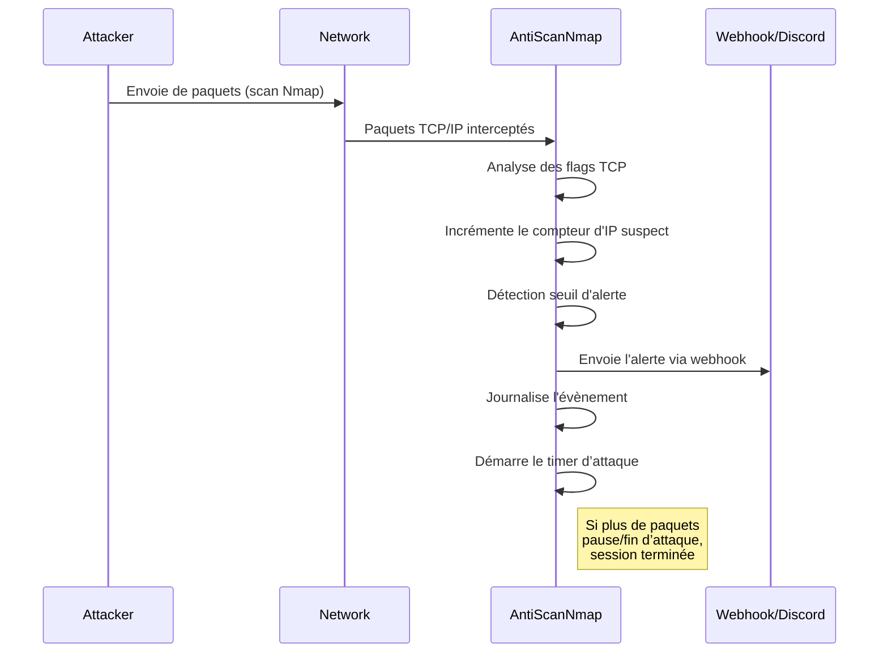

# 🛡️ Documentation Complète de AntiScanNmap

Bienvenue dans la documentation de **AntiScanNmap**, un script Python conçu pour détecter les scans Nmap sur un réseau, alerter via un webhook (par exemple Discord), et consigner les événements dans un journal.  
Ce projet vise à améliorer la sécurité réseau en identifiant rapidement des activités de reconnaissance suspectes.

---

## 🚀 Présentation Générale

AntiScanNmap surveille le trafic réseau en temps réel pour détecter des techniques de scan Nmap courantes (SYN, FIN, NULL, XMAS), puis :
- Déclenche une alerte si plusieurs paquets suspects sont observés depuis la même adresse IP,
- Envoie une notification via un webhook (Discord par exemple),
- Enregistre chaque événement dans un fichier de log local.

> **Compatibilité** :  
> ✔️ Windows  
> ✔️ Linux  
> ❌ MacOS (non supporté)

---

## 📂 Fichiers du Projet

| Fichier               | Rôle                                                                 |
|-----------------------|----------------------------------------------------------------------|
| `protection2.py`      | Script principal de détection, d’alerte et de surveillance réseau.   |
| `README.md`           | Instructions d'installation et de configuration rapide.              |

---

## 📝 protection2.py

### 📌 Résumé et Fonctionnalités

- **Surveillance réseau** en temps réel grâce à Scapy.
- **Détection de scans Nmap** (SYN, FIN, NULL, XMAS).
- **Alerte automatique** via webhook (Discord ou autre).
- **Gestion des faux-positifs** avec une liste d’IP ignorées.
- **Journalisation** des alertes dans un fichier log.
- **Gestion de session d’attaque** : démarre et termine une session d’attaque automatiquement.

---

### 📚 Architecture et Logique Principale

```mermaid
flowchart TD
    A[Initialisation des variables et Webhook] --> B[Capture des paquets réseau avec sniff()]
    B --> C{Le paquet est-il TCP/IP ?}
    C -- Oui --> D{L'adresse source est-elle ignorée ?}
    D -- Non --> E[Analyse des flags TCP : SYN, FIN, NULL, XMAS]
    E -- Suspect --> F[Incrémentation du compteur IP]
    F -- Seuil atteint --> G[Déclenchement de l'alerte]
    G --> H[Envoi du webhook & journalisation]
    G --> I[Démarrage du timer de fin d'attaque]
    I -- Timeout atteint --> J[Arrêt de la session d'attaque]
    C -- Non --> B
    D -- Oui --> B
```

### ⚙️ Déroulement d'un Scan et Cycle d'Alerte



---

### 🧩 Explication du Code et Fonctions

#### Détection des Scans

Le script s’appuie sur la librairie **Scapy** pour capturer les paquets réseau et identifier les signatures de scan Nmap :

| Type de scan | Flags TCP détectés | Description               |
|:------------:|:-----------------:|:--------------------------|
| SYN          | 0x02              | Scan SYN (demande de connexion) |
| FIN          | 0x01              | Scan FIN (fin de connexion)    |
| NULL         | 0x00              | Scan NULL (aucun flag)         |
| XMAS         | 0x29              | Scan XMAS (plusieurs flags)    |

#### Gestion de l’Alerte

- **Seuil d’alerte (`ALERT_THRESHOLD`)** : nombre de paquets suspects avant de déclencher une alerte (par défaut 5).
- **Liste d’IP ignorées (`IGNORED_IPS`)** : permet de ne jamais déclencher d’alerte sur certains hôtes (mais la collecte continue).
- **Webhook Discord** : envoie un message personnalisé à chaque détection/fin d’attaque.

#### Arrêt Automatique

- **Timer d’attaque** : si aucun nouveau paquet suspect n’est reçu pendant `attack_timeout` secondes (par défaut 10s), la session d’attaque est considérée comme terminée.

---

### 🧑‍💻 Structure des Variables Principales

| Variable              | Description                                                        |
|-----------------------|--------------------------------------------------------------------|
| `WEBHOOK_URL`         | Lien du webhook pour notifications (ex : Discord).                 |
| `attack_active`       | Booléen, indique si une attaque est en cours.                      |
| `attack_ongoing`      | Booléen, indique si la session attaque est toujours active.        |
| `last_attack_time`    | Date/heure du dernier paquet suspect reçu.                         |
| `attacker_ip`         | IP de l’attaquant détecté.                                         |
| `victim_ip`           | IP de la victime (souvent la machine surveillée).                  |
| `IGNORED_IPS`         | Set des IP à ne pas alerter.                                       |
| `suspicious_ips`      | Dictionnaire {IP: compteur de paquets suspects}.                   |
| `ALERT_THRESHOLD`     | Nombre de paquets suspects avant alerte (par défaut 5).            |

---

### 🛠️ Utilisation et Personnalisation

- **Exécution** :  
  Lancer le script avec un Python récent (3.x), en mode administrateur/sudo pour accéder à l’interface réseau.
- **Webhook** :  
  Saisir l’URL du webhook lors du démarrage.
- **Ignorer certaines IP** :  
  Ajouter les IP à surveiller sans alerter dans le set `IGNORED_IPS`.

#### Exemple de lancement :

```bash
python protection2.py
```

---

### 📄 Extrait de Code Illustratif

```python
if tcp_flags == 0x02: suspicious_packet = True   # Scan SYN
elif tcp_flags == 0x01: suspicious_packet = True # Scan FIN
elif tcp_flags == 0x00: suspicious_packet = True # Scan NULL
elif tcp_flags == 0x29: suspicious_packet = True # Scan XMAS
```

---

### 📋 API : Webhook d’Alerte

Bien que ce script n’offre pas d’API REST, il **consomme** une API de webhook (Discord, Slack, etc).

```api
{
    "title": "Envoi d'une alerte via Webhook",
    "description": "Envoie un message d'alerte formaté à l'adresse de webhook renseignée (ex : Discord).",
    "method": "POST",
    "baseUrl": "https://discord.com",
    "endpoint": "/api/webhooks/<webhook_id>/<webhook_token>",
    "headers": [
        {
            "key": "Content-Type",
            "value": "application/json",
            "required": true
        }
    ],
    "queryParams": [],
    "pathParams": [],
    "bodyType": "json",
    "requestBody": "{\n  \"content\": \"[INFO] Attaque Nmap détectée : 192.168.1.100 -> 192.168.1.10\"\n}",
    "responses": {
        "204": {
            "description": "Succès, message envoyé.",
            "body": ""
        },
        "400": {
            "description": "Erreur de requête.",
            "body": "{\n  \"message\": \"Invalid Webhook Token\"\n}"
        }
    }
}
```

---

### 📁 Journalisation

Chaque alerte est enregistrée dans un fichier local `nmap_alerts.log`, au format :
```
2024-06-10 21:10:01: [INFO] Attaque Nmap détectée : 192.168.1.100 -> 192.168.1.10
```

---

### 🔎 Exclusion d'IP

Pour ignorer une IP :
```python
IGNORED_IPS = {""} # add a ip for ignored in a scanner
```
> Les IP dans cette liste ne déclenchent pas d'alerte, mais sont toujours surveillées.

---

### ⚠️ Conseils de Déploiement

- **Droits administrateur/sudo requis** pour l’accès aux interfaces réseau.
- Si aucun paquet n’est capturé, essayez :
    ```python
    sniff(prn=detect_nmap_scan, store=0, iface="Ethernet", promisc=True)
    ```
- Vérifiez que l’URL du webhook est correcte.

---

## 📖 README.md

### 🎯 But et Fonctionnement

Le fichier `README.md` décrit le projet en anglais, mais voici son adaptation en français :

- **But** : détecter les scans Nmap sur un réseau, alerter et bloquer.
- **OS supportés** : Windows et Linux.
- **Conseil** : Si aucune attaque n’est détectée, essayez de lancer le script en tant qu’administrateur ou modifiez la ligne de capture réseau comme indiqué.

### 📋 Extrait README

```markdown
# AntiScanNmap
Le script agit comme un anti-scan Nmap, détecte et bloque les scans (attaques). Fonctionne sous Windows et Linux (pas MacOS).

## EN PYTHON ##
Si aucune attaque n'est détectée, exécutez-le en administrateur ou remplacez la ligne 143 :
sniff(prn=detect_nmap_scan, store=0)
par :
sniff(prn=detect_nmap_scan, store=0, iface="Ethernet", promisc=True)
```

---

### 📦 Installation des Dépendances

Le script nécessite principalement **Scapy** et **requests** :

```packagemanagers
{
    "commands": {
        "npm": "",
        "yarn": "", 
        "pnpm": "",
        "bun": "",
        "pip": "pip install scapy requests"
    }
}
```

---

## 🧑‍🔬 Bonnes Pratiques et Sécurité

- **Ne jamais utiliser ce script pour surveiller un réseau sans autorisation !**
- Les logs sont stockés localement, pensez à les protéger.
- Changez le webhook régulièrement pour éviter les abus.

---

## ✅ Résumé des Points Forts

- Détection proactive des scans Nmap en temps réel.
- Alertes instantanées via webhook.
- Journalisation détaillée des événements.
- Adapté pour une utilisation sur serveurs ou postes critiques.
- Extensible pour d'autres types de scan ou notifications.

---

## ❓ FAQ

1. **Le script n’affiche rien, que faire ?**  
   Essayez de lancer avec les droits administrateur/sudo ou précisez l’interface réseau.

2. **Comment changer le seuil d’alerte ?**  
   Modifiez la valeur de `ALERT_THRESHOLD` dans le script.

3. **Puis-je recevoir les alertes ailleurs qu’en Discord ?**  
   Oui, tout service de webhook compatible (Slack, Mattermost...) fonctionnera.

---

## 🎉 Merci d’utiliser AntiScanNmap !

Pour toute amélioration ou adaptation, modifiez et enrichissez le script selon vos besoins réseau.  
**Sécurisez vos infrastructures, restez vigilant !**